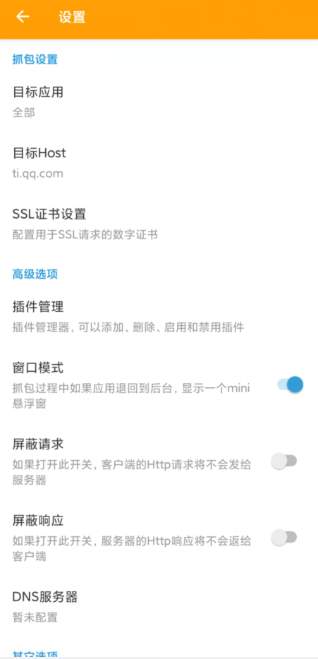
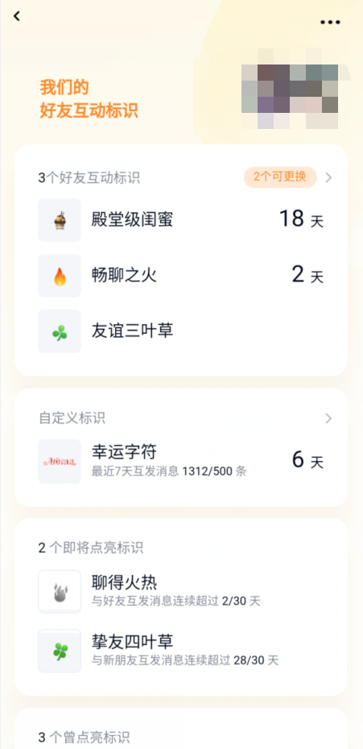
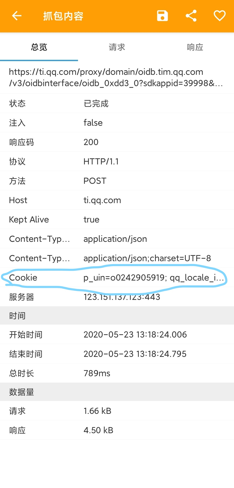

# -批量抽取QQ字符 
##
## 环境要求 ##
> - python 3.x
> - requests
> - lxml
## 功能说明 ##
1. 仅为了方便多目标的抽卡需求，简化手动操作，简化每天多qq号的抽卡需求
2. cookie最多保持两天，即最长要隔一天重新获取cookie
3. 第一次运行需要手动输入所需批量抽卡的qq号和cookie，请根据运行中的提示进行操作，软件会自动在当前目录下建立qq.ini和cookie.ini配置文件，删除后需重新配置
4. 输入错误的qq号需手动在文件目录下qq.ini文件中编辑，记事本打开就可以，qq号按行存放
## 使用方法说明 ##
1. 打开main.py修改第十行的`myself_qq =` 填入自己的qq号，类型为数字int，运行
2. 从手机中捕获cookie，打开抓包软件，选择筛选条件，筛选'ti.qq.com'该域名，建立连接
3. 打开qq好友标识界面
4. 返回抓包软件，点击请求项，复制cookie至程序
5. 开始运行